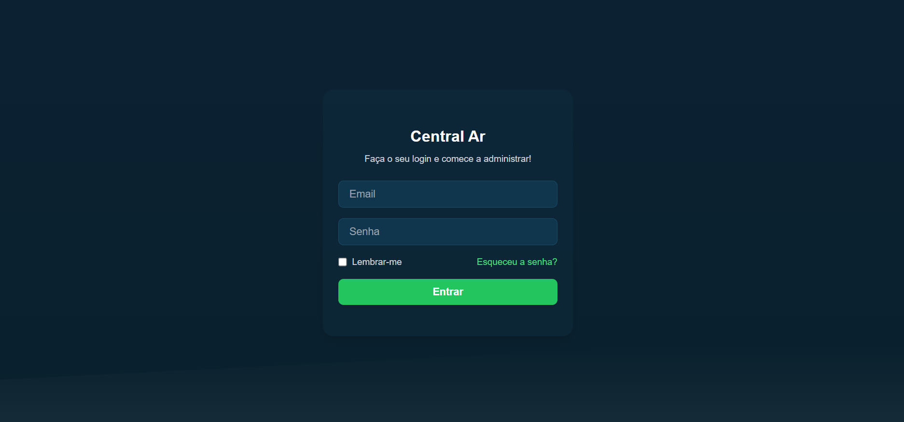
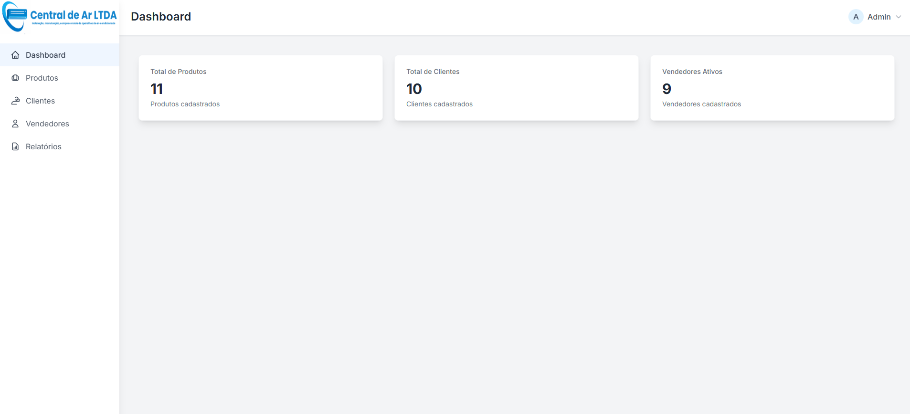
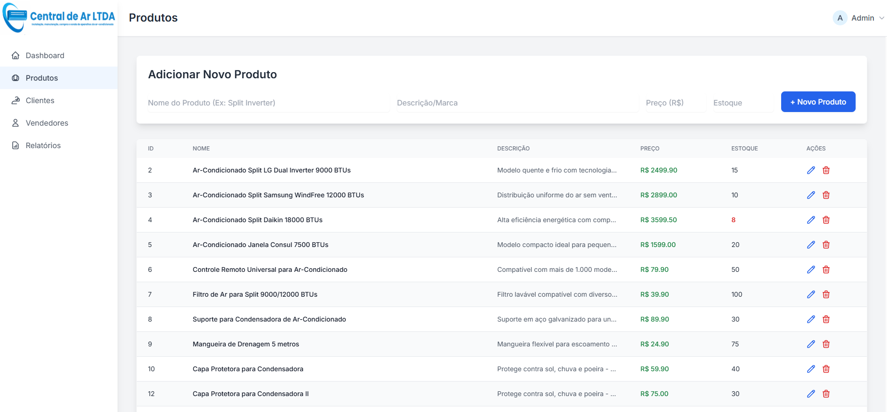
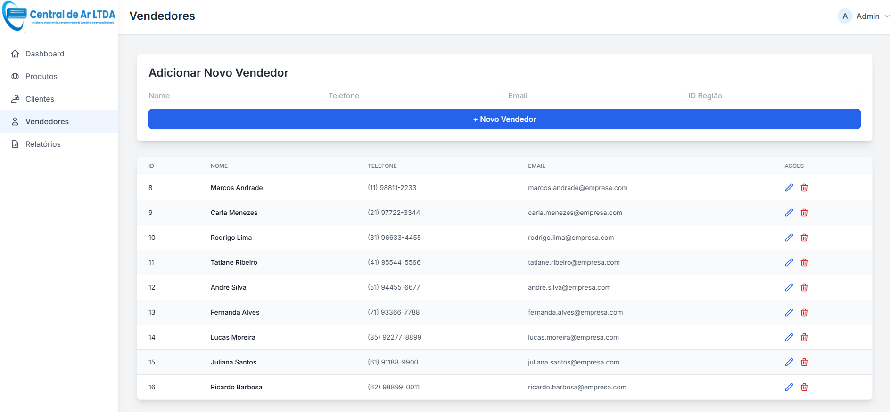
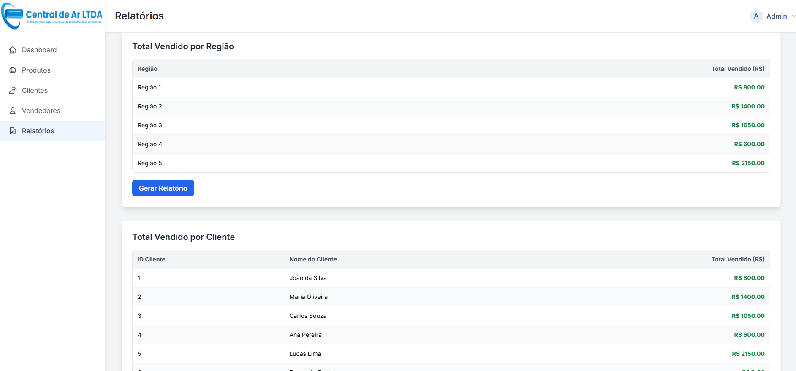
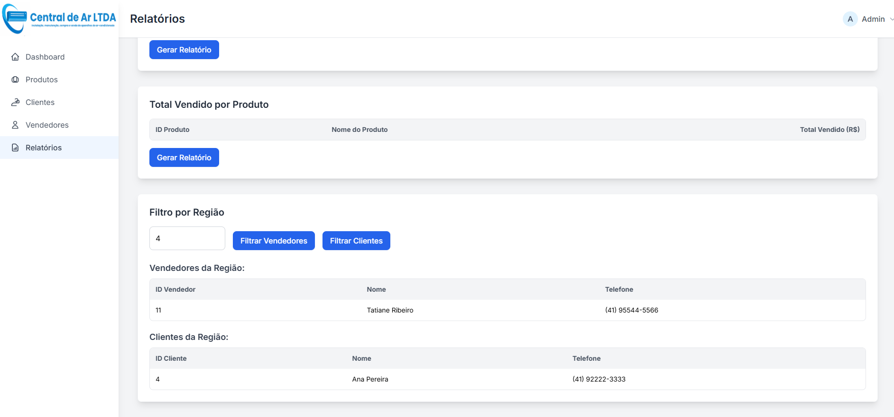

# Central Ar

Sistema desenvolvido para informatizar o setor de vendas da empresa Central Ar e gerar relatórios gerenciais detalhados.  

## Tecnologias utilizadas
- HTML, JavaScript, Tailwind CSS  
- FastAPI  
- SQL Server  

## Integrantes do grupo
- @pedrohenrique-danf  
- @larami06  
- @vcoutinho8  
- @Terres201  
- @Hikaro19  

## Objetivo do projeto
O sistema tem como objetivo organizar e automatizar o processo de vendas, permitindo:  
- Gestão de clientes e produtos  
- Controle de pedidos e produtos vendidos  
- Cálculo de comissão por vendedor (variável por pedido)  
- Controle de vendas por região (com possibilidade de criação de regiões personalizadas)  
- Controle de vendas por cliente  

> Observação: A empresa trabalha com regiões fechadas, ou seja, cada região é atendida por apenas um vendedor.

## Funcionalidades
- Cadastro de clientes, produtos e vendedores  
- Registro de pedidos e itens vendidos  
- Cálculo automático de comissões  
- Criação e gerenciamento de regiões de vendas  
- Visualização de vendas por cliente e por região  

### Prints do sistema
> Aqui você pode adicionar capturas de tela de cada funcionalidade.  
- Tela inicial

- Tela de login

- Tela dashboard

- Controle de produtos  

- Controle de clientes

- Controle de vendedores

- Relatórios gerenciais  

## Relatórios gerenciais
O sistema gera os seguintes relatórios:  
1. Total vendido por região  
2. Total vendido por cliente  
3. Total vendido por vendedor  
4. Vendedores que atendem a determinada região  
5. Clientes de determinada região  
6. Total vendido por produto  

### Exemplo de relatório

## Estrutura do banco de dados
- Tabelas principais: Clientes, Produtos, Vendedores, Pedidos, ItensPedido, Regiões  
- Relacionamentos:  
  - Cada pedido pertence a um cliente  
  - Cada item de pedido pertence a um pedido e a um produto  
  - Cada vendedor atende a uma região  
